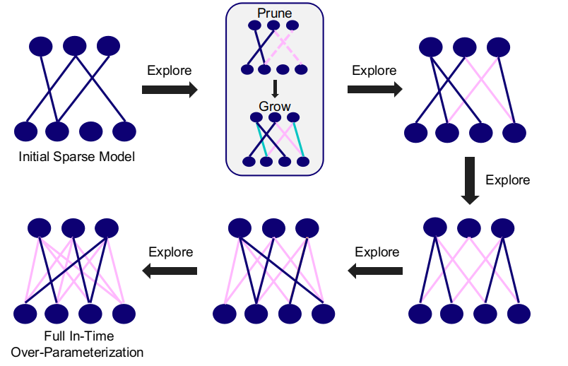

# In-Time-Over-Parameterization

This repo includes codes for the official implementation of the paper "Do We Actually Need Dense Over-Parameterization? In-Time Over-Parameterization in Sparse Training" by Shiwei Liu, Lu Yin, Decebal Constantin Mocanu,  Mykola Pechenizkiy.



This code base is created by Shiwei Liu during his Ph.D. at Eindhoven University of Technology. The implementation is heavily based on Tim Dettmers's implemenation for experiments on the sparse momentum.

## Requirements

The library requires Python 3.6.7, PyTorch v1.0.1, and CUDA v9.0
You can download it via anaconda or pip, see [PyTorch/get-started](https://pytorch.org/get-started/locally/) for further information. 

## Training 
### CIFAR10/100
We provide the training codes In-Time Over-Parameterization (ITOP). 

To train models with SET-ITOP with a typical training time, run this command:

```
python main.py --sparse --seed 18 --sparse_init ERK  --multiplier 1 --lr 0.1 --density 0.05 --update_frequency 1500 --epochs 250 --model vgg-c --data cifar10 --decay_frequency 30000 --batch-size 128 --growth gradient --death magnitude --redistribution none

```

To train models with SET-ITOP with an extended training time, change the value of --multiplier (e.g., 5 times) and run this command:

```
python main.py --sparse --seed 18 --sparse_init ERK  --multiplier 5 --lr 0.1 --density 0.05 --update_frequency 1500 --epochs 250 --model vgg-c --data cifar10 --decay_frequency 30000 --batch-size 128 --growth gradient --death magnitude --redistribution none

```

Options:
* --sparse - Enable sparse mode (remove this if want to train dense model)
* --sparse_init - type of sparse initialization. Choose from: uniform, ERK
* --model (str) - type of networks, choose from RHN and LSTM (default LSTM)
  The following models can be specified with the --model command:
     MNIST:
      MLPCIFAR10
      lenet5
      lenet300-100

     CIFAR-10:
      alexnet-s
      alexnet-b
      vgg-c
      vgg-d
      vgg-like
      wrn-28-2
      wrn-22-8
      wrn-16-8
      wrn-16-10
      ResNet34
* --optimizer (str) - type of optimizers, choose from sgd (Sparse NT-ASGD) and adam (default sgd)

* --growth (str) - growth mode. Choose from: random, random_rnn, gradient (default random)
* --death (str) - removing mode. Choose from: magnitude, magnitude_rnn, SET, threshold (default magnitude)
* --redistribution (str) - redistribution mode. Choose from: magnitude, nonzeros, or none. (default none)
* --density (float) - density level (default 0.33)
* --death-rate (float) - initial pruning rate (default 0.5)

## Evaluation

To evaluate the pre-trained Selfish stacked-LSTM model on PTB, run:

```eval
python main.py --sparse --evaluate model_path --optimizer sgd --model LSTM --cuda --growth random --death magnitude --redistribution none --nonmono 5 --batch_size 20 --bptt 35 --lr 40 --clip 0.25 --seed 5 --emsize 1500 --nhid 1500 --nlayers 2 --death-rate 0.7 --dropout 0.65 --density 0.33 --epochs 100
```

To evaluate t


